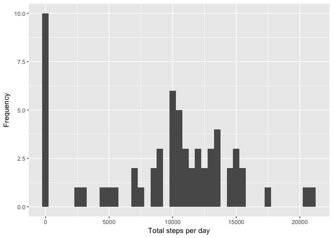
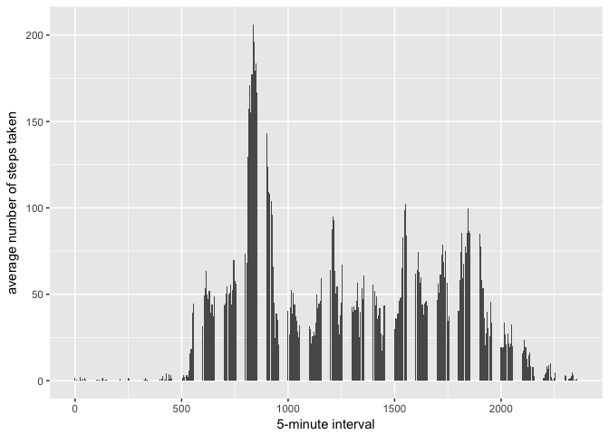
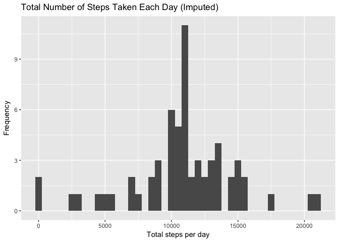
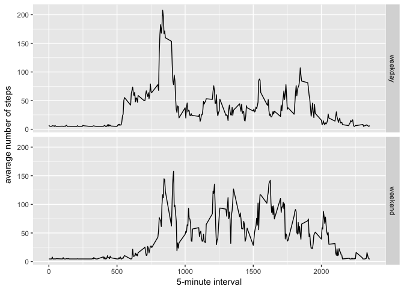

Load File :
-----------

    library(ggplot2)

    ## Warning: package 'ggplot2' was built under R version 3.3.2

    library(scales)

    ## Warning: package 'scales' was built under R version 3.3.2

    library(mice)

    ## Loading required package: Rcpp

    ## mice 2.25 2015-11-09

    activity <- read.csv("activity.csv")
    head(activity)

    ##   steps       date interval
    ## 1    NA 2012-10-01        0
    ## 2    NA 2012-10-01        5
    ## 3    NA 2012-10-01       10
    ## 4    NA 2012-10-01       15
    ## 5    NA 2012-10-01       20
    ## 6    NA 2012-10-01       25

    dim(activity)

    ## [1] 17568     3

    summary(activity)

    ##      steps                date          interval     
    ##  Min.   :  0.00   2012-10-01:  288   Min.   :   0.0  
    ##  1st Qu.:  0.00   2012-10-02:  288   1st Qu.: 588.8  
    ##  Median :  0.00   2012-10-03:  288   Median :1177.5  
    ##  Mean   : 37.38   2012-10-04:  288   Mean   :1177.5  
    ##  3rd Qu.: 12.00   2012-10-05:  288   3rd Qu.:1766.2  
    ##  Max.   :806.00   2012-10-06:  288   Max.   :2355.0  
    ##  NA's   :2304     (Other)   :15840

What is mean total number of steps taken per day? :
---------------------------------------------------

1. Calculate the total number of steps taken per day :
------------------------------------------------------

    stepsperday <- tapply(activity$steps, activity$date, sum, na.rm=TRUE)

    stepsperday

    ## 2012-10-01 2012-10-02 2012-10-03 2012-10-04 2012-10-05 2012-10-06 
    ##          0        126      11352      12116      13294      15420 
    ## 2012-10-07 2012-10-08 2012-10-09 2012-10-10 2012-10-11 2012-10-12 
    ##      11015          0      12811       9900      10304      17382 
    ## 2012-10-13 2012-10-14 2012-10-15 2012-10-16 2012-10-17 2012-10-18 
    ##      12426      15098      10139      15084      13452      10056 
    ## 2012-10-19 2012-10-20 2012-10-21 2012-10-22 2012-10-23 2012-10-24 
    ##      11829      10395       8821      13460       8918       8355 
    ## 2012-10-25 2012-10-26 2012-10-27 2012-10-28 2012-10-29 2012-10-30 
    ##       2492       6778      10119      11458       5018       9819 
    ## 2012-10-31 2012-11-01 2012-11-02 2012-11-03 2012-11-04 2012-11-05 
    ##      15414          0      10600      10571          0      10439 
    ## 2012-11-06 2012-11-07 2012-11-08 2012-11-09 2012-11-10 2012-11-11 
    ##       8334      12883       3219          0          0      12608 
    ## 2012-11-12 2012-11-13 2012-11-14 2012-11-15 2012-11-16 2012-11-17 
    ##      10765       7336          0         41       5441      14339 
    ## 2012-11-18 2012-11-19 2012-11-20 2012-11-21 2012-11-22 2012-11-23 
    ##      15110       8841       4472      12787      20427      21194 
    ## 2012-11-24 2012-11-25 2012-11-26 2012-11-27 2012-11-28 2012-11-29 
    ##      14478      11834      11162      13646      10183       7047 
    ## 2012-11-30 
    ##          0

2. Total steps per day
----------------------

    qplot(stepsperday, xlab='Total steps per day', ylab='Frequency',binwidth=500)

3. Mean and Median of total steps per day
-----------------------------------------

    stepbymean <- mean(stepsperday)
    stepbymean

    ## [1] 9354.23

    stepbymedian <- median(stepsperday)
    stepbymedian

    ## [1] 10395

4. Time series plot - avg daily steps
-------------------------------------

    averagesteps <- aggregate(x=list(meansteps=activity$steps), by=list(interval=activity$interval), FUN=mean, na.rm=TRUE)

    ggplot(data=averagesteps, aes(x=interval, y=meansteps), binwidth=300) +
        geom_histogram(stat="identity" ) +
        xlab("5-minute interval") +
        ylab("average number of steps taken" ) 

    ## Warning: Ignoring unknown parameters: binwidth, bins, pad

5. The 5-minute interval
------------------------

    maxsteps <- which.max(averagesteps$meansteps)
    timetosteps <-  gsub("([0-9]{1,2})([0-9]{2})", "\\1:\\2", averagesteps[maxsteps,'interval'])
    timetosteps

    ## [1] "8:35"

6. Imputing missing data
------------------------

    impactivity <- activity
    impactivity$steps[is.na(impactivity$steps)] <- mean(activity$steps, na.rm=TRUE)

7. Imputed Histogram
--------------------

    impstepsperday <- tapply(impactivity$steps, impactivity$date, sum, na.rm=TRUE)
    qplot(impstepsperday, xlab='Total steps per day', ylab='Frequency',main="Total Number of Steps Taken Each Day (Imputed)",binwidth=500)

8. Panel plot for weekdays and weekends
---------------------------------------

    impactivity$dateType <-  ifelse(as.POSIXlt(impactivity$date)$wday %in% c(0,6), 'weekend', 'weekday')

    averagedActivityDataImputed <- aggregate(steps ~ interval + dateType, data=impactivity, mean)

    ggplot(averagedActivityDataImputed, aes(interval, steps)) + 
        geom_line() + 
        facet_grid(dateType ~ .) +
        xlab("5-minute interval") + 
        ylab("avarage number of steps")

